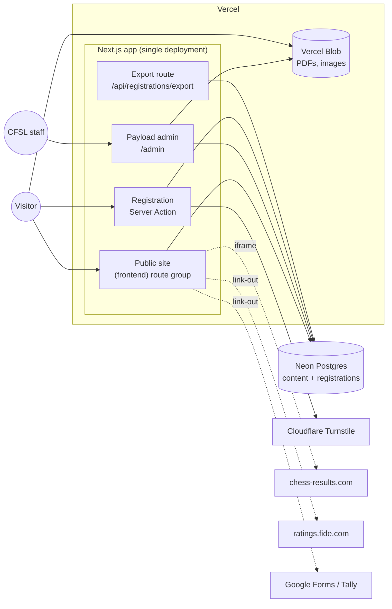

# CFSL Website — Architecture

**Date:** 2026-09-23
**Scope:** Launch scope L1–L12 in [requirements-complexity-and-launch-scope.md](requirements-complexity-and-launch-scope.md).
**Principle:** One app, one database, one deployment. Add a service only when a launch requirement can't be met without it.

## Decisions

| Area | Decision | Why |
|---|---|---|
| Framework | **Next.js** (App Router, TypeScript) | Required. Server Components and Server Actions cover every launch page and the registration form, so no separate API is needed. |
| UI | **shadcn/ui** + Tailwind CSS | Required. The components live in the repo, so the mobile-first design system is ours to change. |
| CMS | **Payload 3**, embedded in the Next.js app | Runs inside the same Next.js app and deployment, stores its data in Neon Postgres and its files in Vercel Blob. There's no separate CMS service and no CMS bill. |
| Database | **Neon Postgres** via `@payloadcms/db-postgres` | Required. Holds both content and registrations. Neon branching gives every PR its own database copy. |
| File storage | **Vercel Blob** via `@payloadcms/storage-vercel-blob` | Required. Holds prospectuses, governance PDFs, downloadable forms and images. |
| Auth | **Payload built-in auth** (email + password) | Only CFSL staff log in at launch. A separate auth service would add a second user store for no gain. Revisit when player accounts arrive (phase 3, "My Chess Profile"). Clerk is the likely choice then. |
| Admin UI | **Payload admin panel** at `/admin` | Content editing, registration management, "mark as paid" and export all happen in one panel. No custom dashboard. |
| Anti-spam | **Cloudflare Turnstile** on the registration form | Free and works on any Vercel plan. |
| Email | **None at launch** | No confirmation emails (L3). A super-admin resets admin passwords by hand in the admin panel. |
| Hosting | **Vercel Hobby** for now | See [Risks](#risks): Hobby's terms don't cover an organisation's site. |
| Environments | **Production + a preview for each PR** | The Neon–Vercel integration creates a database branch for each preview deployment. Production deploys from `main`. |

## System overview



There are no other runtime services. chess-results.com, FIDE and the form providers are only embedded or linked to. We never call them from the server.

## Repository layout

One repo holding a single Next.js app, based on Payload's official Next.js + Postgres + Vercel Blob starter.

```
src/
  app/
    (frontend)/            Public site: layouts, pages, shadcn components
    (payload)/             Payload admin + REST/GraphQL routes (generated by Payload)
  collections/             Payload collection configs
  globals/                 Payload global configs
  components/ui/           shadcn/ui components
  lib/
    registration/          Eligibility rules, Zod schema, capacity check
    export/                CSV and TRF writers
  payload.config.ts
```

## Content model

Payload collections (repeating content) and globals (one-off settings). Every launch item maps to one of them.

| Name | Kind | Key fields | Serves |
|---|---|---|---|
| `users` | Collection (auth) | email, name, `role`: `admin` \| `editor` | L1 |
| `media` | Upload → Blob | file, alt, caption | All |
| `events` | Collection | title, slug, `type`: tournament \| school \| deadline \| national-team \| seminar, start/end date, venue, eligibility (rich text), prospectus (upload), `chessResultsUrl`, `registration` group (see below) | L2, L4, L5 |
| `registrations` | Collection | event, section, player fields, `paid` (bool), `paidAt`, `paidBy`, submitted at | L3 |
| `news` | Collection | title, slug, date, `category`, `isAnnouncement`, hero image, body | L6, L11 |
| `documents` | Collection (upload → Blob) | title, `category`: constitution \| regulations-policies \| circulars \| annual-reports \| strategic-plans, `documentDate`, description | L7 |
| `people` | Collection | name, role, `body` (Executive Committee or a named Commission), photo, term start/end, order | L8 |
| `downloads` | Collection | title, category (club / player / coach-arbiter / other), PDF upload **or** external form URL | L9 |
| `pages` | Collection | title, slug, body, `comingSoon` flag | L12 and other static pages |
| `homepage` | Global | pinned announcements, featured events (the rest is filled automatically from the newest items) | L11 |
| `navigation` | Global | main menu items | L1 |

### Event registration config (`events.registration`)

| Field | Notes |
|---|---|
| `enabled` | Turns the form on for this event. |
| `opensAt` / `closesAt` | Registration window (Asia/Colombo time). The form accepts entries only inside it. |
| `fee`, `paymentInstructions` | Shown on the form. Payment happens outside the site. |
| `ageReferenceDate` | `jan-1` or `dec-31` **of the event's year**. The date on which a player's age is measured for age categories. |
| `sections[]` | Each section has a name (e.g. "U12", "Open"), an optional max age ("Under N"), min/max rating and a `capacity`. |
| `fields` | For each field, **Required \| Optional \| Hidden**. The fields are a fixed set: date of birth, sex, email, phone/WhatsApp, school or club, coach, rating. |

Some fields sit outside `fields`:

- **Last name and other names** are always required.
- **FIDE ID** always shows and is optional, because first-time players don't have one yet.
- **Guardian name and contact** appear, and become required, only when the date of birth makes the player **under 18 on the event's start date**.

**Age categories:** "Under N" means the player is younger than N on the reference date. For example, with `jan-1` a U6 player in a tournament on 30 September 2026 must be under 6 on 1 January 2026. With `dec-31` the player must be under 6 on 31 December 2026.

**Duplicates:** one entry per FIDE ID per event. Entries without a FIDE ID aren't checked.

## Rendering and caching

| Page | Strategy |
|---|---|
| News, events, documents, people, downloads, pages | Static, tagged with `revalidateTag`. An `afterChange`/`afterDelete` hook on each collection invalidates its tag, so a published edit goes live within seconds and no redeploy is needed. |
| Homepage | Static, invalidated by the tags of everything it shows. |
| Calendar (L4) | One static list of `events`, filtered by type and "Upcoming / Past" through URL search params. |
| Document library search (L7) | A Server Component query using Payload's `like` on title and description, with `category` and year filters taken from search params. Postgres handles a few hundred documents easily, so no search service is needed. |
| Event entry list | Rendered dynamically on the event page, so a new entry appears as soon as it's submitted. |
| Rankings (L10) | The `/rankings` route handler returns a 307 redirect to `federation_set.php?federation=SRI&period=<YYYY-MM>-01`, with the month taken from the current date in Asia/Colombo. The nav link never goes stale and nothing needs caching. |

## Tournament registration (L3)

### Submission flow

1. The event page renders the form from `events.registration`. It shows only the sections open to the player, the fields that aren't Hidden, and the fee with payment instructions.
2. A **Server Action** receives the submission and:
   1. Verifies the Turnstile token with Cloudflare.
   2. Checks the input against a Zod schema **built from the event's field config**, so the same rules run on the client and the server.
   3. Checks the registration window, then eligibility against the chosen section: age on the event's `ageReferenceDate`, and rating as entered. Eligibility is **self-declared** and admins verify it against FIDE by hand.
   4. Requires guardian details if the player is under 18 on the event's start date.
   5. In a **single Postgres transaction**: locks the event row (`SELECT … FOR UPDATE`), rejects the entry if its FIDE ID is already registered for the event or the section is full, and otherwise inserts the registration. A partial unique index on `(event, fide_id) WHERE fide_id IS NOT NULL` backs up the duplicate check.
3. The form confirms success on screen. No email is sent.

A full section shows as **"Full"** and can't be selected. There's no waitlist. Admins raise `capacity` to reopen it.

### Admin workflow (Payload admin)

- The `registrations` list view can be filtered by event, section and paid status.
- **Mark as paid:** a bulk action and a per-row toggle. Each sets `paidAt` and `paidBy`.
- **Export:** a custom button on the list view calls `GET /api/registrations/export?event=<id>&format=csv|trf`. The route checks the Payload session and that the user's role is `admin`.
  - **CSV:** one row per entry with every collected field.
  - **TRF:** a FIDE **TRF-16** file with tournament header lines (`012` name, `042`/`052` dates) and one `001` player line per entry: start rank, sex (`m`/`w`, or blank if not collected), name as `Last, Other names`, rating, federation, FIDE ID, and birth date as `YYYY/MM/DD`. The title field is left blank, because Swiss-Manager fills in titles and current ratings from the FIDE list by FIDE ID. Federation defaults to `SRI`, and the arbiter corrects it for foreign players in Swiss-Manager. The file is sorted by rating, highest first, then by name, which matches the usual seeding. Pairing and round columns are left empty.

### Public entry list

Shown on the event page: **name, FIDE ID, rating, school/club, section**. Date of birth, email, phone, coach and guardian details are never public.

## Access control

| Resource | Public | `editor` | `admin` |
|---|---|---|---|
| Content collections and globals | Read (published only) | Create / edit / publish | Everything |
| `registrations` | Create through the form only. Entry-list fields are read server-side. | No access | Everything, including export |
| `users` | — | Own profile only | Manage users, reset passwords |

Payload access functions enforce these rules. The public entry list is read by a server-side query that selects only the public fields. The Payload REST/GraphQL API never serves registrations publicly.

## Embeds and external links

| Integration | How | Fallback |
|---|---|---|
| chess-results.com (L5) | An `<iframe>` of `chessResultsUrl` on the event page. The CMS field only accepts `chess-results.com` URLs. | Always show an "Open on chess-results.com" link beside the iframe, which covers both the mobile-width risk and any future frame blocking. |
| Social sharing (L6) | Plain share URLs (Facebook, WhatsApp, X), plus `navigator.share` on mobile. Open Graph metadata comes from each news item. | No third-party SDKs. |
| Forms (L9) | `downloads` entries of type external URL open Google Forms or Tally in a new tab. | — |

## File storage

- All Blob files are **public**. Everything uploaded at launch (prospectuses, governance documents, forms, images) is meant to be public. Registrations include no file uploads.
- Enable `clientUploads` on the Blob adapter, so the browser sends large PDFs straight to Blob instead of through a function with a request-body limit.

## Environments and delivery

| Environment | Trigger | Database |
|---|---|---|
| Local | `pnpm dev` | A personal Neon branch or local Postgres |
| Preview | Every PR | A Neon branch created by the Neon–Vercel integration, deleted when the PR closes |
| Production | Merge to `main` | The Neon `main` branch |

- **Schema changes:** use Payload migrations (`payload migrate:create`), committed to the repo and run by the build command before `next build`. Don't use dev-mode schema push anywhere except local.
- **Secrets** (Vercel env vars): `DATABASE_URL` (set by the Neon integration), `PAYLOAD_SECRET`, `BLOB_READ_WRITE_TOKEN`, `TURNSTILE_SECRET_KEY`, `NEXT_PUBLIC_TURNSTILE_SITE_KEY`.
- **Backups:** Neon point-in-time restore, within the plan's history window.

## Deferred items and how they fit

| Deferred item | Extension point |
|---|---|
| Stories, press releases | New `news` categories |
| Galleries, video library, brand hub | New collections on the same `media` / Blob setup |
| Club directory, records and history | New collections. Link them to a `players` collection once one exists. |
| Player profiles | A `players` collection. Registrations can then reference a player instead of copying the details. |
| Confirmation emails, newsletter | Add Resend (it has an official Payload email adapter) |
| Player accounts, personalisation | Add Clerk for public users. Payload auth stays for staff. |
| Online payments | A payment provider webhook sets `registrations.paid` |
| Analytics | Vercel Web Analytics (S) |

## Risks

| Risk | Detail | Mitigation |
|---|---|---|
| Vercel Hobby terms | Hobby's terms don't allow commercial or organisational use, and its limits on functions, Blob and team seats are lower. | Move to Pro before public launch. The move needs no code changes. |
| Neon free tier cold starts | Free compute suspends when idle, so the first request after a quiet period is slower. | Content pages are served from the Vercel cache, so only the admin panel and registrations hit a cold database. Upgrade if it becomes noticeable. |
| No password-reset email | A locked-out admin depends on a super-admin. | Keep at least two `admin` accounts. Adding Resend later fixes this. |
| Self-declared eligibility | Registrants can enter a wrong date of birth or rating. | Admins verify against FIDE before pairing. The paid/verified check happens in the admin panel. |
| Personal data of minors | Dates of birth and guardian contacts are stored **indefinitely**, as decided. | Admin-only access, never public, and no public API access. |
| chess-results.com and FIDE | Covered in the requirements doc. | The link-out fallback is always shown, and the redirect route is the only place the FIDE URL format lives. |

## Resolved questions

| # | Question | Decision |
|---|---|---|
| Q1 | Registration window | Each event has opening and closing dates. |
| Q2 | Age reference date | Set per event: 1 January or 31 December of the event's year. |
| Q3 | Duplicate entries | Blocked by FIDE ID within an event. FIDE ID is optional for first-time players. |
| Q4 | TRF format | TRF-16 `001` player lines. Sex is a configurable field and title isn't collected (see [Admin workflow](#admin-workflow-payload-admin)). |
| Q5 | Data retention | Registrations are kept in the database indefinitely. |
| Q6 | Domain | The default `*.vercel.app` domain for now. A custom domain comes later. |
